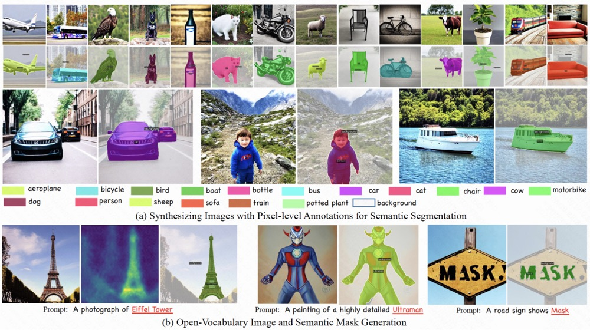

# DiffuMask (ICCV 2023)
DiffuMask: Synthesizing Images with Pixel-level Annotations for Semantic Segmentation Using Diffusion Models

<p align="center">
  
<br>
</p>


## :hammer_and_wrench: Getting Started with DiffuMask
### Conda env installation

```sh
conda create -n DiffuMask python=3.8

conda activate DiffuMask
```

```
 install pydensecrf https://github.com/lucasb-eyer/pydensecrf
pip install git+https://github.com/lucasb-eyer/pydensecrf.git

pip install -r requirements.txt
```
```
If there is an error: 

bug for cannot import name 'autocast' from 'torch', 

please refer to the website:  

https://github.com/pesser/stable-diffusion/issues/14
```

### 1. Data and mask generation
```
# generating data and attention map witn stable diffusion (Before generating the data, you need to modify the "hunggingface key" in the "VOC_data_generation.sh" script to your own key. )
sh ./script/DiffusionGeneration/VOC_data_generation.sh
```

### 2. Refine Mask with AffinityNet (Coarse Mask)

We also offer the AffinityNet weight for the 'dog' class on [Google Drive](https://drive.google.com/file/d/1rZJRUl-bCDNTFwGbCg6EO8GrtXcjguiJ/view?usp=sharing) and 'bird' class on [Google drive](https://drive.google.com/file/d/1622_4opTZko0COXuWN_RZ8ZGhioyVeqo/view?usp=sharing).
```
# prepare training data for affinity net
sh ./script/prepare_aff_data.sh

# train affinity net
Before training, you need to download the ResNet-38 ImageNet pre-trained weights and place them in the "./pretrained_model" directory
sh ./script/train_affinity.sh

# inference affinity net
sh ./script/infer_aff.sh

# generate accurate pseudo label with CRF
sh ./script/curve_threshold.sh
```

### 3. Noise Learning (Cross Validation) 

At this stage, it is necessary to train Mask2Former using cross-validation to filter out noisy data. Before training Mask2Former, data augmentation needs to be performed on the dataset.
```
sh ./script/augmentation_VOC.sh
```


To start training the model, please note the following points:

- In this repository, only data for one class (airplanes) is generated. During the training process, it is recommended to include other categories as negative samples. You can generate data for other categories or directly use other categories from the VOC dataset. The corresponding masks are not required, and the labels for other categories can be set to 0.

- During the training process, augmented data (concatenated images) with the original data (original images) all should be used.

### 4. Training Mask2former with clear data


We are providing synthetic data for the "dog" category here with [Baidu Drive](https://pan.baidu.com/s/1rtr610DYrjgepDKBrMrmkQ) (password: 53rb) and "Bird" category  with [Baidu Drive](https://pan.baidu.com/s/1REbkL0Q5go9zzLzr36cHyg) (password: 8v7q). Feel free to use it.


## Citation

```
@article{wu2023diffumask,
  title={Diffumask: Synthesizing images with pixel-level annotations for semantic segmentation using diffusion models},
  author={Wu, Weijia and Zhao, Yuzhong and Shou, Mike Zheng and Zhou, Hong and Shen, Chunhua},
  journal={Proc. Int. Conf. Computer Vision (ICCV 2023)},
  year={2023}
}
```
